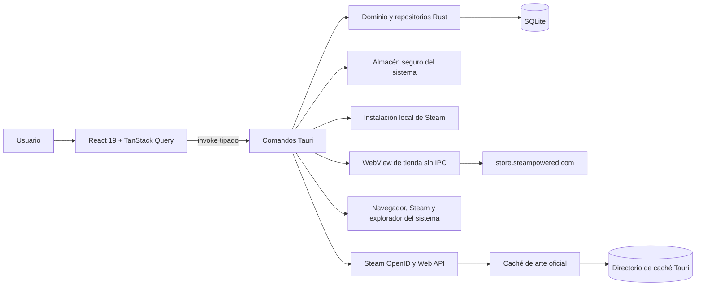
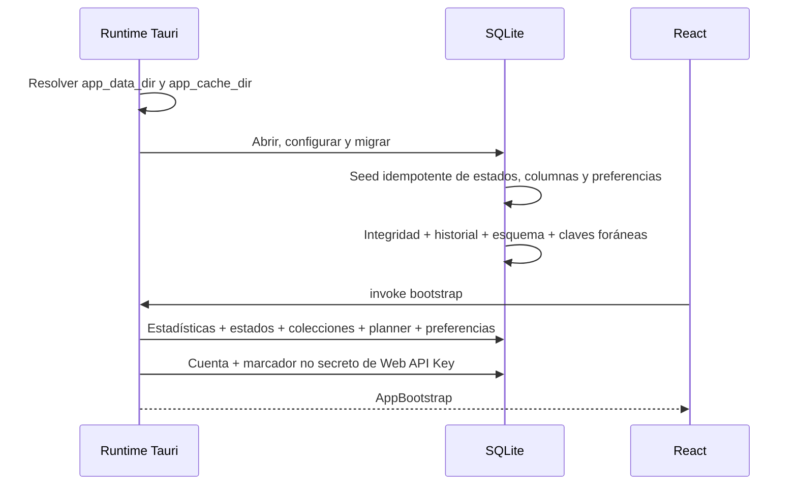
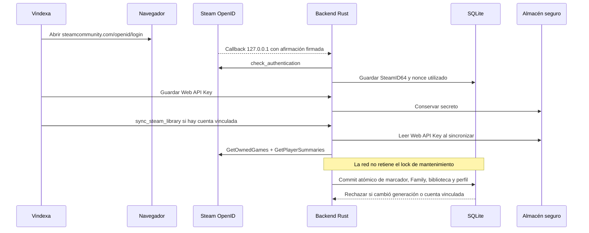
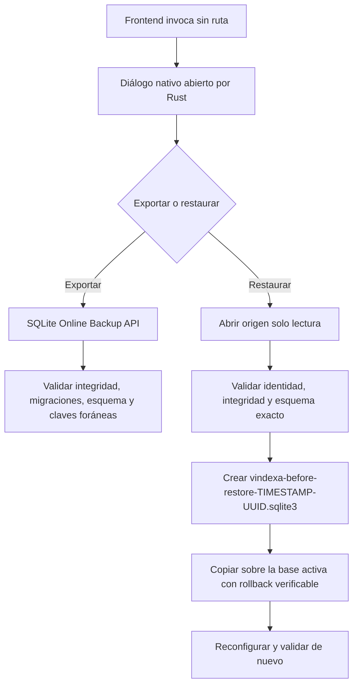

# Arquitectura de Vindexa

Este documento describe la arquitectura que existe **hoy** en el repositorio. Se mantiene con
el código, así que no se ata a un número de versión: si algo aquí no coincide con lo que hay,
el documento es el que está mal.
El brief define una visión más amplia; cuando difieren, aquí se documenta el comportamiento
del código ejecutable.

## Índice

- [Vista general](#vista-general)
- [Fronteras y módulos](#fronteras-y-módulos)
- [Flujos de datos](#flujos-de-datos)
- [Persistencia](#persistencia)
- [Integración con Steam](#integración-con-steam)
- [Seguridad y errores](#seguridad-y-errores)
- [Decisiones y límites](#decisiones-y-límites)

## Vista general

Vindexa es una aplicación Tauri 2 con una ventana principal de recursos empaquetados y una
ventana remota opcional, aislada, para la tienda oficial de Steam. React renderiza la
interfaz principal; todos los datos duraderos y las operaciones privilegiadas pertenecen al
proceso Rust. No existe un backend remoto de Vindexa.



| Capa | Tecnología | Responsabilidad |
| --- | --- | --- |
| Presentación | React, TypeScript, shadcn/Radix, Tailwind | Navegación, formularios, estados de carga/error/vacío y accesibilidad. |
| Estado asíncrono | TanStack Query | Consulta, mutación e invalidación del snapshot nativo. |
| Colecciones grandes | TanStack Virtual | Montaje limitado de filas de lista y filas de cuadrícula. |
| Interacciones | dnd-kit | Planificador y movimiento de biblioteca por puntero o teclado. |
| Frontera nativa | Comandos Tauri | Deserialización tipada, errores serializables y tareas bloqueantes fuera del hilo asíncrono. |
| Dominio/persistencia | Rust, rusqlite | Validación, transacciones, consultas, reglas inteligentes, backup y diagnóstico. |
| Integraciones | reqwest, steamlocate, keyring | Steam OpenID/Web API, manifiestos locales y secreto del sistema. |

## Fronteras y módulos

### Frontend

- `src/app/VindexaApp.tsx` configura el límite de errores, TanStack Query y tooltips.
- `src/features/shell/` contiene el marco de ventana y las secciones Biblioteca,
  Planificador, Colecciones y Seguimiento.
- `src/features/library/` pagina de 240 en 240, virtualiza la colección cargada y abre una
  ficha inmersiva para metadatos y organización personal. Los AppID visibles arrancan una
  cola de enriquecimiento persistente sin bloquear el scroll. También contiene Steam Family,
  filtros, sesiones, tags y drag and drop de biblioteca.
- `src/features/planner/` mantiene un estado optimista durante el arrastre y persiste el
  destino en SQLite.
- `src/features/collections/` crea y elimina colecciones y solicita al backend una vista
  previa de reglas inteligentes.
- `src/features/discovery/` reúne seguimiento, recordatorios, olvidados, casi terminados,
  publicaciones oficiales cacheadas, relaciones explicables y recomendación local.
- `src/features/settings/` reúne Steam, preferencias, backups, diagnóstico y privacidad.
- `src/lib/tauri.ts` es el cliente IPC. La interfaz no importa SQL, `reqwest`, Keychain ni
  APIs del sistema de archivos.
- `src/lib/types.ts` refleja los modelos serializados por Rust con nombres `camelCase`.

### Backend

- `src-tauri/src/lib.rs` crea los directorios de datos/caché, inicializa SQLite, registra
  plugins y expone los comandos permitidos.
- `src-tauri/src/commands.rs` es la frontera IPC. Las operaciones SQLite y de sistema de
  archivos se envían a `spawn_blocking`; la red sigue un flujo asíncrono.
- `src-tauri/src/db/library.rs` implementa estadísticas, filtros, paginación, ficha,
  actualización personal, upsert de Steam y recomendación.
- `src-tauri/src/db/metadata_queue.rs` persiste prioridad, deduplicación, TTL, reintentos y
  recuperación de trabajos interrumpidos para el enriquecimiento de la biblioteca.
- `src-tauri/src/db/personal.rs` implementa etiquetas, asignaciones, fechas y sesiones.
- `src-tauri/src/db/library_dnd.rs` aplica y deshace lotes de estado/colección con recibos
  verificables.
- `src-tauri/src/db/family_catalog.rs` mantiene el catálogo familiar separado.
- `src-tauri/src/db/discovery.rs` implementa recordatorios, observaciones, caché/cadencia de
  publicaciones, relaciones por empresa persistida y recomendaciones descartadas.
- `src-tauri/src/db/organization.rs` implementa estados, colecciones, reglas inteligentes,
  planificador y preferencias con transacciones.
- `src-tauri/src/db/migrations.rs` aplica las migraciones incrustadas y registra su versión.
- `src-tauri/src/steam/` separa OpenID, Web API, secretos, manifiestos, noticias oficiales y
  acciones externas. `metadata_enrichment.rs` limita la cola a dos peticiones y separa cada
  inicio 750 ms; `news_api.rs` solo consulta por HTTPS el host oficial, sin redirects ni Web
  API Key, y limita tiempo, MIME y tamaño antes de parsear.
- `src-tauri/src/art_cache.rs` valida origen, tipo MIME, firma, tamaño y destino antes de
  conservar una imagen.
- `src-tauri/src/store_window.rs` crea la ventana remota privada y restringe navegación,
  popups y descargas en todas las plataformas. Antes de navegar instala una lista nativa de
  contenido mediante `WKContentRuleList` en macOS o WebKitGTK en Linux; ambas rutas fallan
  cerradas. Otros sistemas conservan el aislamiento común sin ese filtro adicional.
- `src-tauri/src/error.rs` convierte errores internos a `{ code, message }` serializable.

### Contrato IPC

Los comandos se registran mediante una lista cerrada en `src-tauri/src/lib.rs`. Entre los
comandos consumidos por la interfaz están:

| Área | Comandos principales |
| --- | --- |
| Inicio | `bootstrap`, `get_database_diagnostics`, `save_preferences` |
| Biblioteca | `list_games`, `get_library_filter_options`, `get_game_detail`, `refresh_game_metadata`, `refresh_game_achievements`, `update_game`, `bulk_update_status` |
| Registro personal | `list_tags`, `save_tag`, `delete_tag`, `set_game_tags`, `list_game_sessions`, `save_game_session`, `delete_game_session`, `save_personal_dates` |
| Drag and drop | `apply_library_drop`, `undo_library_drop` |
| Organización | `save_collection`, `preview_smart_collection`, `delete_collection`, `move_planner_item` |
| Importación | `import_local_steam`, `sync_steam_library` |
| Cuenta | `start_steam_login`, `save_steam_api_key`, `delete_steam_api_key`, `verify_saved_steam_api_key`, `unlink_steam` |
| Copias | `export_backup`, `import_backup` |
| Steam/sistema | `launch_game`, `install_game`, `uninstall_game`, `open_store`, `reveal_installation` |
| Family/descubrimiento | `list_family_catalog`, `get_family_catalog_game`, `get_discovery_snapshot`, `refresh_discovery_news`, `save_reminder`, `complete_reminder`, `snooze_reminder`, `dismiss_recommendation`, `restore_recommendation` |
| Arte | `cache_game_art`, `clear_art_cache` |
| Escritorio | `save_preferences`, `check_for_updates` |

Rust registra además primitivas transaccionales para estados, columnas, pertenencias,
reglas y caché; la UI las compone en formularios, menús y operaciones por lote.

## Flujos de datos

### Inicio de la aplicación



El bootstrap también comprueba si existe una cuenta vinculada y una instalación local de
Steam. Para la clave consulta únicamente `app_settings.steam_api_key_configured`: nunca lee
Keychain durante el inicio o al refrescar la interfaz. Si el marcador todavía no existe
tras una migración, devuelve `apiKeyVerificationRequired = true` y la interfaz ofrece una
comprobación voluntaria. No inserta juegos ficticios.

### Importación local

1. `steamlocate` localiza instalaciones y bibliotecas de Steam.
2. Rust recorre manifiestos legibles y obtiene AppID, nombre, ruta, tamaño, build y fecha de
   actualización cuando están presentes.
3. El upsert actualiza metadatos del juego y reconstruye el estado de instalación local.
4. `INSERT OR IGNORE` crea organización personal solo para AppID nuevos. Los estados,
   notas, progreso, prioridad, rating, seguimiento y colecciones existentes no se
   reemplazan.
5. Una transacción completa todo el escaneo o lo revierte.

El escaneo local no aporta perfil ni tiempo jugado: esos campos necesitan la Web API.

### Vinculación y sincronización remota



La sincronización remota no reinicia el indicador de instalación local y no escribe en
`game_personal`, salvo al crear la fila inicial para un juego nuevo. Cuando hay una cuenta
vinculada y el intervalo es mayor que cero, React mantiene un temporizador mientras la
ventana está abierta, evita sincronizaciones solapadas y vuelve a invalidar las consultas al
terminar. El temporizador solo se activa si el marcador confirma la clave y no está pendiente
la comprobación voluntaria.

Las peticiones a Steam ocurren fuera del lock global para que biblioteca, ficha y autosave
sigan respondiendo incluso con una red lenta. Un lock específico impide dos sincronizaciones
remotas simultáneas. Al terminar la red, Rust toma exclusión solo durante un commit SQLite
único de marcador de clave, catálogo familiar, biblioteca, perfil y estado de sincronización.
Una generación compartida y la identidad vinculada invalidan respuestas obtenidas antes de
una importación, restauración o cambio de cuenta; el snapshot obsoleto nunca se persiste.

Guardar una clave con una cuenta ya vinculada encadena exactamente una sincronización. El
campo del formulario se vacía después del guardado. Un fallo remoto conserva la biblioteca,
marca `last_sync_status = failed` y persiste un código y un mensaje acotado; una
sincronización correcta limpia ese diagnóstico.

### Edición personal

La ficha construye un `UpdateGameInput` completo. Rust valida rangos, existencia del estado,
fecha ISO real y canónica, duración positiva y límites Unicode de 500 caracteres para próxima
acción, 2.000 para checkpoint y 20.000 para notas. Después normaliza strings opcionales y
actualiza `game_personal` dentro de una transacción.
Etiquetas, fechas y sesiones tienen comandos y validaciones propias; las relaciones y el
historial se actualizan atómicamente. Cada cambio relevante añade una entrada a `activity`.
Tras guardar, TanStack Query invalida bootstrap, biblioteca, filtros y ficha para volver a
leer SQLite.

### Metadatos, logros y descubrimiento

Abrir la ficha puede disparar una actualización pública de descripción, hero, estudio,
editor, géneros, categorías y lanzamiento. El resultado queda cacheado con estado explícito
`success`, `unavailable` o `failed`. Los logros no se consultan automáticamente: una acción
del usuario abre el almacén seguro y usa `GetPlayerAchievements`.

Cada snapshot fiable de lanzamiento/Early Access puede producir una observación. Solo una
comparación posterior genera un evento. Para juegos seguidos, `GetNewsForApp/v2` aporta
publicaciones del feed `steam_community_announcements`; SQLite conserva un lote acotado y
la próxima cadencia, con backoff tras fallos. No se llaman «importantes» porque el método
público no expone esa semántica. Los lanzamientos relacionados se derivan solo de fechas ISO y
desarrollador/editor persistidos por una actualización de metadatos marcada como `success`:
cada empresa del listado debe coincidir exactamente tras normalizar mayúsculas y espacios,
la disponibilidad familiar debe seguir confirmada y la UI expone ese criterio.

### Drag and drop de biblioteca

El frontend convierte un juego o multiselección en un lote y solo reconoce destinos que
existan en el bootstrap. Rust valida AppID únicos, estado o colección manual y aplica todo en
una transacción. La respuesta incluye un recibo con estado/orden previo. Deshacer exige que
el destino siga exactamente como quedó tras el lote; si hubo una edición posterior, falla
sin sobrescribirla.

### Copia y restauración



Una copia incluye la base SQLite completa, pero no la Web API Key ni la caché de imágenes.
El frontend recibe solo `true` si el usuario completó la operación o `false` si canceló el
diálogo; ninguna ruta seleccionada cruza IPC. Rust rechaza la base activa, sus sidecars,
enlaces simbólicos, alias por identidad de archivo y copias incompatibles. Un lock global de
mantenimiento bloquea nuevas operaciones de base durante importación, sincronización,
exportación y restauración; un lock interno serializa además las copias.

## Persistencia

### Configuración SQLite

Cada conexión aplica:

```sql
PRAGMA foreign_keys = ON;
PRAGMA journal_mode = WAL;
PRAGMA synchronous = FULL;
PRAGMA temp_store = MEMORY;
```

También configura un `busy_timeout` de cinco segundos. Al inicializar se ejecutan
`PRAGMA integrity_check`, validación de historial de migraciones, huella del esquema y
`foreign_key_check`. Diagnóstico repite `integrity_check` y muestra el modo de journal, la
versión de esquema, el tamaño y la ruta activa.

### Modelo de datos

| Grupo | Tablas | Propósito |
| --- | --- | --- |
| Configuración | `app_settings`, `steam_accounts` | Preferencias no secretas e identidad Steam. |
| Catálogo | `games`, `family_catalog_games`, `game_installations`, `image_cache` | Metadatos propios/locales, catálogo familiar separado, instalación y arte. |
| Organización | `game_personal`, `statuses`, `tags`, `game_tags` | Decisiones privadas del usuario. |
| Colecciones | `collections`, `collection_games`, `smart_rules` | Grupos manuales e inteligentes. |
| Planificación | `planner_columns`, `planner_items`, `planner_settings` | Columnas, cola, periodos, límites, objetivos y capacidad. |
| Historial | `game_sessions`, `activity`, `recommendation_history`, `sync_runs` | Sesiones, actividad, decisiones y ejecuciones de sync. |
| Descubrimiento | `game_reminders`, `game_metadata_observations`, `discovery_events`, `steam_news_items`, `steam_news_fetch_state` | Recordatorios, cambios observados, caché oficial y cadencia remota. |
| Seguridad/migración | `openid_nonces`, `schema_migrations` | Prevención de replay y versión aplicada. |

`game_search` es una tabla virtual FTS5 sobre título, notas, checkpoint y próxima acción.
Triggers la mantienen al cambiar los campos indexados. Los índices convencionales cubren
título, tiempo jugado, última sesión, estado/posición, instalación, seguimiento, fechas,
colecciones y planner.

### Ubicaciones

Tauri calcula los directorios a partir del identificador `io.vindexa.desktop`:

- `app_data_dir/vindexa.sqlite3`: base principal y archivos WAL/SHM mientras SQLite los
  necesite.
- `app_data_dir/vindexa-before-restore-AAAAmmdd-HHMMSS-UUID.sqlite3`: respaldo previo a
  una restauración.
- `app_cache_dir/steam-art/<app-id>/<variant>.<ext>`: arte oficial descargado por el backend.
- Almacén seguro del sistema, servicio `io.vindexa.desktop`, cuenta
  `steam-web-api-key`: secreto remoto.

La ruta exacta de la base depende del sistema y se muestra en Ajustes. No debe deducirse ni
codificarse en scripts de usuario.

## Integración con Steam

La implementación remota usa:

- `https://steamcommunity.com/openid/login` para OpenID 2.0.
- `IPlayerService/GetOwnedGames/v0001/` para juegos, nombres, iconos y tiempos.
- `ISteamUser/GetPlayerSummaries/v0002/` para nombre visible, avatar, perfil y visibilidad.
- Hosts HTTPS de Steam allowlisted para arte.

Las URLs `steam://run/<app-id>`, `steam://install/<app-id>` y
`steam://uninstall/<app-id>` solo se construyen después de validar que el AppID es distinto
de cero; desinstalar exige además una instalación primaria registrada. La tienda se abre en
una ruta HTTPS fija. Para revelar una carpeta, Rust la canonicaliza y comprueba que siga
bajo una biblioteca Steam detectada.

`ISteamUserStats/GetPlayerAchievements/v0001/` se usa solo bajo demanda. La ficha pública
usa `store.steampowered.com/api/appdetails`, que se trata como fuente no contractual con
caché y estados desconocidos.

La tienda no se abre en el navegador general: `store_window.rs` crea/reutiliza una ventana
incógnita sin IPC, limita la navegación superior al host exacto y deniega popups/descargas.
En macOS y Linux parte de `about:blank`, compila reglas WebKit con timeout y solo navega si
se instalaron; si falla, cierra la ventana. macOS usa `WKContentRuleList`; Linux llama a la
API nativa de filtros de WebKitGTK porque el wrapper seguro empleado no expone aún ese tipo.
Consulta [STEAM_SETUP.md](./STEAM_SETUP.md) para los límites.

## Seguridad y errores

- La capability de la ventana `main` autoriza únicamente abrir la URL exacta
  `https://steamcommunity.com/dev/apikey`. Los diálogos de archivos, OpenID, tienda,
  esquemas `steam://` y revelado de carpetas se ejecutan desde comandos Rust y no conceden
  permisos generales al WebView.
- La CSP restringe scripts y conexiones; solo permite imágenes desde hosts Steam
  definidos, el protocolo de assets y recursos empaquetados.
- `freezePrototype` está activo.
- El protocolo de assets solo expone `$APPCACHE/steam-art/**`.
- Reqwest rechaza redirecciones para OpenID, Web API, metadatos, logros y arte.
- Las consultas usan parámetros. La única interpolación SQL dinámica selecciona columnas
  u órdenes desde allowlists internas, no texto del usuario.
- La caché limita cada archivo a 10 MiB, valida HTTPS, host, AppID en la ruta, MIME y magic
  bytes, y escribe mediante archivo temporal.
- OpenID exige estado coincidente, endpoint/return URL exactos, campos firmados, validación
  directa con el proveedor, nonce reciente y no reutilizado. Solo admite un login activo,
  un máximo de 180 segundos, 64 callbacks, 32 KiB por petición local y 64 KiB de respuesta
  del proveedor.
- Cada respuesta JSON de Steam Web API debe declarar `application/json` y queda limitada a
  32 MiB; cada imagen de la caché queda limitada a 10 MiB.
- La ventana `steam-store` no recibe capabilities Tauri, usa modo privado y no comparte la
  CSP/bridge privilegiado de la ventana principal. macOS y Linux añaden un bloqueador nativo
  acotado y fail-closed; no es un adblock completo. La ruta Linux aún necesita validación
  runtime en Bazzite real.
- Los errores enviados a React contienen un código y un mensaje para el usuario. La clave
  Web API no forma parte de esos errores. El diagnóstico persistido de sincronización
  recorta el mensaje a 500 caracteres y sustituye contenido con URLs o parámetros de clave.

## Decisiones y límites

### Decisiones vigentes

1. **SQLite local como fuente de verdad.** Evita depender de un servicio Vindexa y permite
   copia y restauración portátiles.
2. **Separar `games` de `game_personal`.** Una resincronización puede actualizar datos Steam
   sin sustituir decisiones del usuario.
3. **Secretos fuera de la base.** La Web API Key no viaja en backups ni consultas IPC de
   lectura. SQLite solo conserva un marcador no secreto para evitar tocar Keychain al
   iniciar.
4. **OpenID en navegador externo.** Vindexa no representa una pantalla de acceso de Steam
   ni recibe sus credenciales.
5. **Backend Rust para red y sistema.** El WebView no recibe permisos HTTP o de archivos
   generales.
6. **Paginación más virtualización.** SQLite limita cada página y React monta solo la ventana
   visible.
7. **Mantenimiento exclusivo y breve.** Un `RwLock` de proceso permite lecturas ordinarias
   en paralelo y excluye importaciones, commits de sincronización y copias para impedir
   carreras con una restauración. Las peticiones remotas de Steam y Discovery no retienen el
   lock: cada persistencia comprueba la generación de la base antes de escribir.
8. **Tienda remota aislada.** La continuidad visual no justifica cargar HTML remoto en la
   ventana con IPC; se usa otro WebView limitado.

### Límites conocidos

- La sincronización periódica vive en la ventana React: no despierta la aplicación cerrada
  ni funciona como una tarea de sistema en segundo plano.
- La desinstalación solo entrega una solicitud al cliente Steam; no borra archivos ni conoce
  el resultado final.
- Metadatos de tienda proceden de una fuente pública no contractual y logros requieren una
  acción expresa, clave y privacidad suficientes. Steam Deck queda desconocido.
- Steam Family depende de señal local y visibilidad; Vindexa no puede certificar licencia o
  elegibilidad de lanzamiento.
- La ventana de tienda no es un navegador general. El bloqueo acotado de macOS/Linux no
  garantiza eliminar todo seguimiento, y la ruta Linux sigue sin validación runtime en
  Bazzite real.
- La comprobación de updates informa `notConfigured`: no hay endpoint, clave pública,
  descarga o instalación. Tampoco hay firma/notarización ni telemetría.
- La compilación y ejecución en Bazzite requieren un gate nativo separado; no se pueden
  certificar desde macOS.

Consulta [DATABASE.md](./DATABASE.md) para el esquema y
[docs/adr/README.md](./docs/adr/README.md) para la justificación de estas decisiones.
