# Esquema y persistencia de Vindexa

SQLite es la fuente de verdad de Vindexa. Este documento describe el esquema vigente de la
migración **13** y sus invariantes; los archivos SQL de `src-tauri/migrations/` son la fuente
normativa ejecutable.

## Índice

- [Configuración de conexión](#configuración-de-conexión)
- [Relación principal](#relación-principal)
- [Tablas](#tablas)
- [Campos e invariantes relevantes](#campos-e-invariantes-relevantes)
- [Búsqueda e índices](#búsqueda-e-índices)
- [Migraciones](#migraciones)
- [Copia y restauración](#copia-y-restauración)
- [Ubicación y datos sensibles](#ubicación-y-datos-sensibles)

## Configuración de conexión

Cada conexión activa:

```sql
PRAGMA foreign_keys = ON;
PRAGMA journal_mode = WAL;
PRAGMA synchronous = FULL;
PRAGMA temp_store = MEMORY;
```

Además, Rust configura un `busy_timeout` de cinco segundos. Al iniciar se comprueban
`integrity_check`, `foreign_key_check`, identidad de aplicación, historial de migraciones y
huella del esquema.

## Relación principal

```mermaid
erDiagram
    GAMES ||--|| GAME_PERSONAL : organiza
    GAMES ||--o{ GAME_INSTALLATIONS : instala
    GAMES ||--o{ GAME_TAGS : etiqueta
    TAGS ||--o{ GAME_TAGS : define
    GAMES ||--o{ COLLECTION_GAMES : agrupa
    COLLECTIONS ||--o{ COLLECTION_GAMES : contiene
    COLLECTIONS ||--o{ SMART_RULES : evalua
    GAMES ||--o{ PLANNER_ITEMS : planifica
    PLANNER_COLUMNS ||--o{ PLANNER_ITEMS : contiene
    GAMES ||--o{ GAME_SESSIONS : registra
    GAMES ||--o{ ACTIVITY : genera
    GAMES ||--o{ GAME_REMINDERS : recuerda
    GAMES ||--o{ DISCOVERY_EVENTS : observa
    GAMES ||--o{ GAME_METADATA_OBSERVATIONS : compara
    GAMES ||--o{ RECOMMENDATION_HISTORY : recomienda
    GAMES ||--o{ IMAGE_CACHE : cachea
```



`family_catalog_games` se mantiene separado de `games`: que Steam Family muestre un AppID
no demuestra todavía que sea jugable desde el equipo. Solo la evidencia local confirmada
permite incorporarlo a la biblioteca personal como `family_shared`.

## Tablas

| Grupo | Tablas | Responsabilidad |
| --- | --- | --- |
| Control | `schema_migrations`, `app_settings` | Versiones aplicadas y preferencias no secretas. |
| Cuenta | `steam_accounts`, `openid_nonces`, `sync_runs` | Identidad, resultado de sincronización y replay prevention. |
| Catálogo | `games`, `family_catalog_games` | Metadatos de biblioteca propia/local y catálogo familiar separado. |
| Instalación/arte | `game_installations`, `image_cache` | Rutas, tamaño, build y referencias de caché. |
| Organización | `game_personal`, `statuses`, `tags`, `game_tags` | Estado, progreso, fechas, texto personal y clasificación transversal. |
| Colecciones | `collections`, `collection_games`, `smart_rules` | Grupos manuales, orden y reglas AND/OR. |
| Planificación | `planner_columns`, `planner_items`, `planner_settings` | Kanban, cola, periodos, objetivos y capacidad. |
| Historial | `game_sessions`, `activity`, `recommendation_history` | Sesiones, línea temporal y recomendaciones descartadas. |
| Descubrimiento | `game_reminders`, `game_metadata_observations`, `discovery_events`, `steam_news_items`, `steam_news_fetch_state` | Recordatorios, cambios observados, publicaciones oficiales cacheadas y cadencia/backoff. |

## Campos e invariantes relevantes

### `games`

- `app_id` es la clave estable y debe ser mayor que cero.
- Tiempo total y reciente nunca son negativos; una sincronización no reduce el total ya
  conocido.
- JSON de géneros/categorías usa arrays incluso cuando no hay datos.
- `metadata_status` y `achievements_status` distinguen `pending`, `success`, `unavailable`
  y `failed`; desconocido no se convierte en cero.
- `ownership_source` distingue `owned`, `family_shared` y `local`.
- `family_availability` distingue `not_applicable`, `unknown` y `confirmed`.

### `game_personal`

- Existe una fila por juego y referencia un estado válido.
- Progreso: 0–100; prioridad: 0–5; valoración opcional: 1–10.
- Instalado, fijado y seguimiento son booleanos restringidos.
- Fecha de finalización y abandono son mutuamente excluyentes y no pueden preceder al
  inicio.
- Steam no sobrescribe estos datos durante un upsert.

### Etiquetas y sesiones

- El nombre de una etiqueta, tras `trim`, tiene 1–40 caracteres y es único.
- El color es hexadecimal `#RRGGBB`.
- Cada juego admite como máximo 64 etiquetas y la sustitución del conjunto es transaccional.
- Una sesión requiere inicio válido; el final, si existe, no puede precederlo.
- Progreso antes/después es opcional y está entre 0 y 100.
- La nota de sesión admite como máximo 2.000 caracteres.
- El historial se ordena por inicio e ID descendentes y se pagina entre 1 y 100 filas por
  solicitud; la UI carga 50 y ofrece continuar.
- Borrar una etiqueta elimina sus asociaciones; borrar una sesión no borra el juego.

### Colecciones y drag and drop

- Una colección es `manual` o `smart`; `match_mode` es `all` o `any`.
- Solo una colección manual admite pertenencias persistidas y drop directo.
- `collection_games.position` conserva el orden estable.
- Un lote de drag and drop acepta hasta 10.000 AppID únicos y se aplica en una transacción.
- El recibo de deshacer contiene el estado u orden previo y solo se aplica si el destino no
  ha cambiado desde la operación original.

### Planificador

- Cada juego puede aparecer una sola vez gracias a `UNIQUE(app_id)`.
- La posición dentro de columna y `queue_position` son independientes.
- `planned_for` representa el periodo elegido; `target_date` la fecha objetivo.
- El objetivo está limitado a 160 caracteres.
- Capacidades semanal y mensual tienen límites positivos definidos en la migración 008.

## Búsqueda e índices

`game_search` es una tabla virtual FTS5 que indexa título, notas, checkpoint y próxima
acción. Triggers reconstruyen el documento al cambiar título o texto personal. Los filtros
de estado, instalación, seguimiento, progreso, valoración, tags, logros, Deck, fechas,
colecciones y planificador disponen de índices específicos antes de paginar.

El orden aleatorio recibe una semilla desde la interfaz para ser estable durante la página
actual. Todas las ordenaciones añaden título/AppID como desempate determinista.

## Migraciones

| Versión | Nombre | Cambio principal |
| ---: | --- | --- |
| 1 | `initial` | Esquema base, organización, planner, actividad y caché. |
| 2 | `indexes` | Índices, FTS5 y triggers de búsqueda. |
| 3 | `steam_sync_diagnostics` | Código y mensaje persistentes de fallo remoto. |
| 4 | `library_sorting` | Índices para ordenaciones de biblioteca. |
| 5 | `store_metadata` | Descripción y estado de metadatos públicos. |
| 6 | `game_hero` | Arte hero. |
| 7 | `steam_metadata_complete` | Procedencia, disponibilidad familiar y estado de logros. |
| 8 | `planner_advanced` | Cola, periodo, objetivo y capacidades. |
| 9 | `tracking_discovery` | Recordatorios, observaciones y eventos de descubrimiento. |
| 10 | `library_filters` | Índices para filtros combinables. |
| 11 | `family_catalog` | Catálogo familiar separado. |
| 12 | `personal_sessions_tags` | Validación e índices de tags, sesiones y fechas. |
| 13 | `legacy_ownership_provenance` | Corrección conservadora de procedencia heredada. |
| 14 | `metadata_enrichment_queue` | Cola persistente, prioridad y reintentos de metadatos. |
| 15 | `discovery_signals` | Caché y estado de refresco del feed oficial de Steam. |

> [!WARNING]
> Una migración ya publicada o aplicada es inmutable: no se edita su SQL. Una corrección se
> añade como nueva versión. Vindexa valida la huella para detectar divergencias.

La migración 13 solo demueve a `local` filas anteriores a la procedencia que carecen de toda
señal exclusiva de `GetOwnedGames`. Una sincronización oficial posterior vuelve a promover
el AppID a `owned`.

`steam_news_items` solo acepta el feed `steam_community_announcements`. La tabla de estado
conserva último intento/éxito, fallos consecutivos y próximo intento; no contiene la Web API
Key ni mensajes remotos. Un éxito reemplaza atómicamente el lote del juego y programa seis
horas de caché. Las relaciones entre lanzamientos no se guardan: se recalculan desde
`games.release_date`, `developer` y `publisher` para no quedar obsoletas.

## Copia y restauración

La exportación usa SQLite Online Backup y no copia la caché ni la Web API Key. La
restauración valida la base en solo lectura, crea un respaldo previo en el directorio de
datos, sustituye mediante SQLite y vuelve a ejecutar todos los gates. Ante un fallo,
restaura y verifica la base anterior.

No copies solo `vindexa.sqlite3` mientras la aplicación está abierta: WAL puede contener
cambios pendientes. Usa **Ajustes → Datos y copias → Exportar copia**.

## Ubicación y datos sensibles

La ruta real depende del sistema y se muestra en Diagnóstico. La base contiene SteamID64,
rutas, biblioteca, notas, checkpoints, fechas, etiquetas, sesiones y planificación en texto
legible. Protégela como información privada. La Web API Key vive en el almacén seguro y no
forma parte de SQLite.
