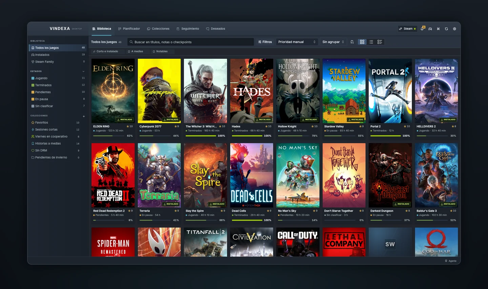
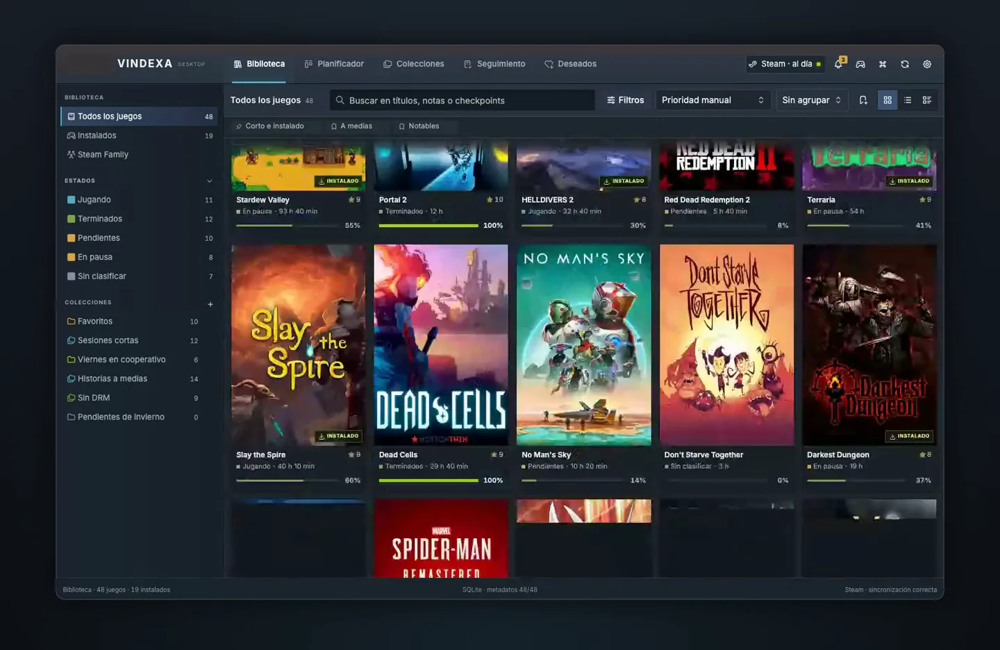
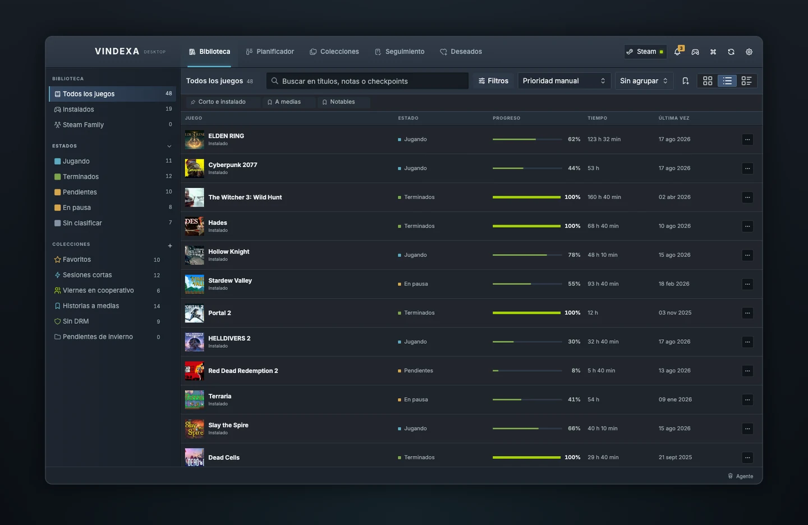
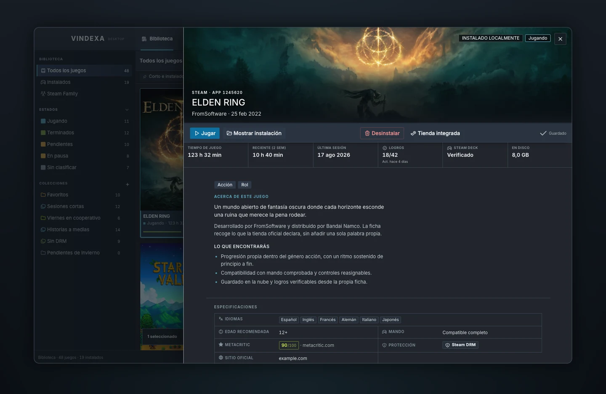
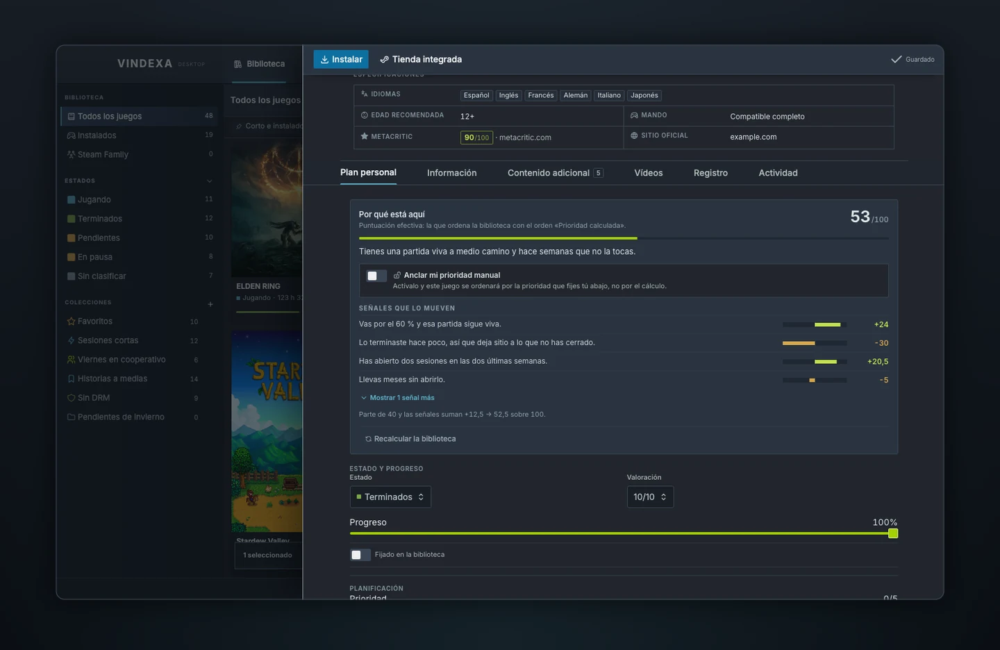
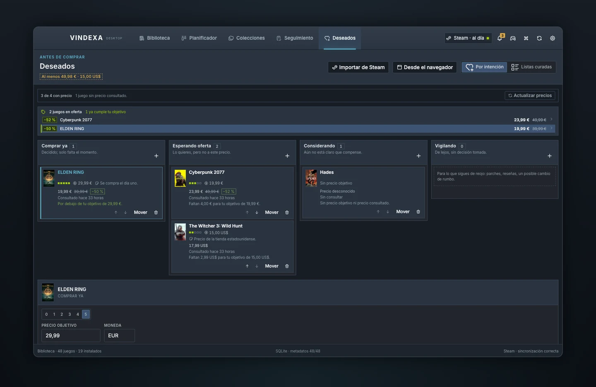
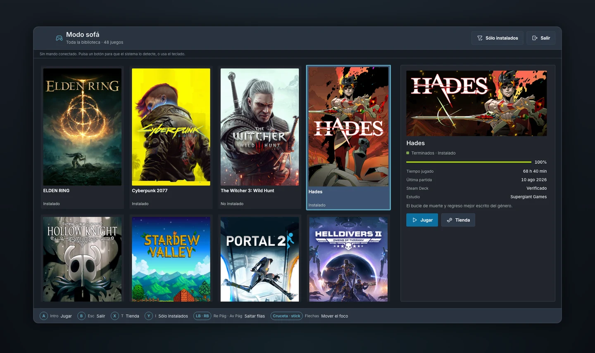
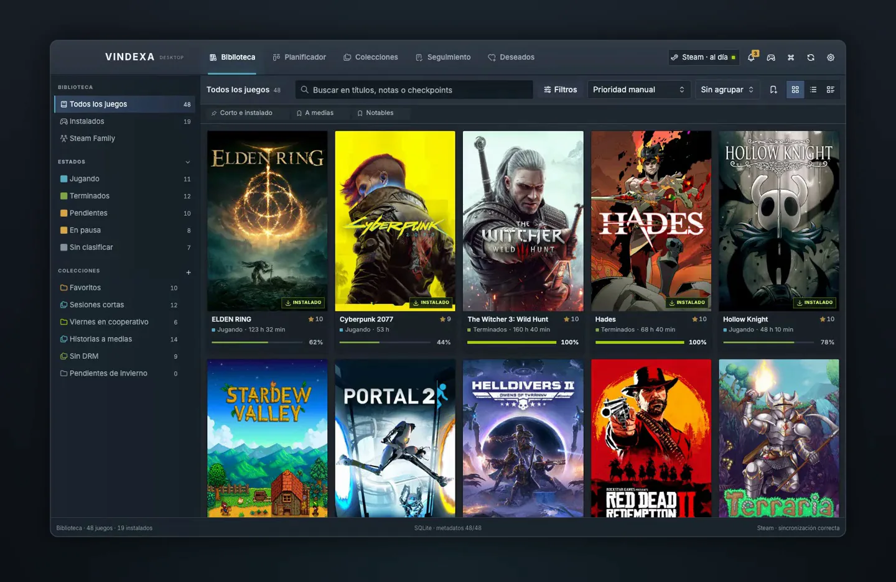
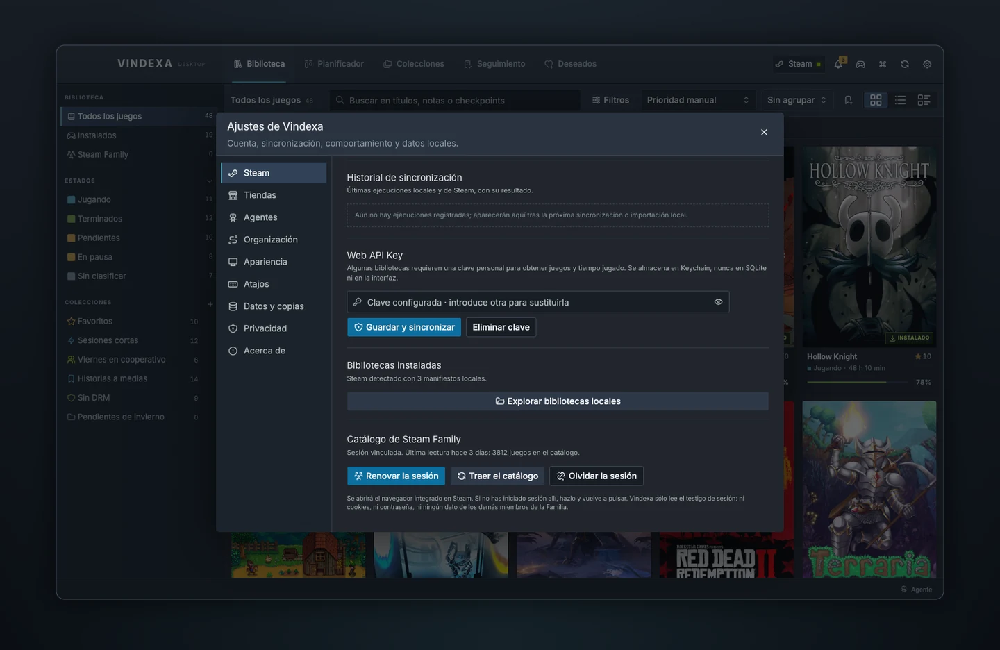

<div align="center">

# VINDEXA

**Tu biblioteca de juegos, organizada de verdad.**

Steam, Epic, GOG e itch.io en una sola aplicación de escritorio.
Sin cuenta, sin servidor, sin telemetría: tus datos se quedan en tu equipo.

[](https://github.com/SwonDev/Vindexa/releases/latest)
[](#instalación)
[](./LICENSE)
[](https://github.com/SwonDev/Vindexa/actions/workflows/ci.yml)



</div>

## El problema

Una biblioteca de tres mil juegos no es una biblioteca: es un archivo. Steam sabe
cuáles tienes y cuántas horas les has echado, pero no sabe cuál dejaste a medias,
cuál te apetece este viernes, ni cuál compraste en oferta hace cuatro años y
sigue sin abrir. Y si además compras en Epic, en GOG o en itch.io, ni siquiera
hay un sitio donde estén todos.

Vindexa es ese sitio. No es un launcher más ni un escaparate: es un índice
personal para **decidir qué jugar, seguirlo y terminarlo**.

<div align="center">

<video src="https://github.com/SwonDev/Vindexa/raw/main/docs/media/recorrido-biblioteca.mp4" poster="./docs/media/recorrido-biblioteca-cartel.webp" width="100%" controls muted loop playsinline>
  
  <a href="https://github.com/SwonDev/Vindexa/raw/main/docs/media/recorrido-biblioteca.mp4">Ver el recorrido por la biblioteca (MP4, 9 s)</a>
</video>

<em>Miles de juegos, desplazamiento sin tirones, arte oficial en caché local.</em>

</div>

## Qué hace

<table>
<tr>
<td width="50%" valign="top">

### Una biblioteca que aguanta el tamaño

Cuadrícula, lista o ultracompacta, siempre virtualizada. Búsqueda de texto
completo, filtros combinables, diecisiete criterios de orden y agrupación por
estado, género, año, estudio o antigüedad de la última sesión. Cada vista
recuerda su búsqueda, sus filtros y dónde te habías quedado.

</td>
<td width="50%" valign="top">



</td>
</tr>
<tr>
<td width="50%" valign="top">



</td>
<td width="50%" valign="top">

### Una ficha que no se inventa nada

Arte oficial, descripción de la tienda, logros, compatibilidad con mando,
protección anticopia, idiomas y espacio en disco. Lo que la tienda no ha dicho
aparece como **sin confirmar**, con el motivo exacto. Nunca como un cero ni como
un hueco en blanco.

</td>
</tr>
<tr>
<td width="50%" valign="top">

### Prioridad explicable

Vindexa te dice qué jugar ahora y **por qué**: qué señales mueven la puntuación
de cada juego y cuánto aporta cada una. Terminar algo le baja la prioridad
aunque sigas jugándolo. Y si fijas una prioridad a mano, el cálculo no la pisa.

</td>
<td width="50%" valign="top">



</td>
</tr>
<tr>
<td width="50%" valign="top">



</td>
<td width="50%" valign="top">

### Deseados con precio y objetivo

Cuatro cubos de intención —comprar ya, esperando oferta, considerando,
vigilando—, precio objetivo por juego y aviso cuando la tienda baja del umbral.
Los importes de monedas distintas nunca se suman: sumarlos sería inventar un
total que no existe.

</td>
</tr>
</table>

### Y además

| | |
| --- | --- |
| **Planificador** | Kanban, cola, semana y mes, con objetivos, capacidad y límites de trabajo en curso. |
| **Colecciones** | Manuales o inteligentes, con reglas validadas y vista previa antes de guardar. |
| **Seguimiento** | Olvidados, casi terminados, próximos lanzamientos y publicaciones recientes. |
| **Avisos** | Reglas programables sobre lo que Vindexa ya observa, con bandeja y deduplicación. |
| **Modo sofá** | Interfaz para mirar a dos metros, navegable con mando, que detecta si el juego es compatible con tu sistema antes de ofrecerte instalarlo. |
| **Paleta de comandos** | `⌘K` y ya está: juegos, secciones, vistas y acciones. |
| **Navegador integrado** | Las tiendas oficiales en una ventana aislada, sin acceso a la aplicación. En macOS y Linux, además, con bloqueo nativo de publicidad y rastreo. |
| **Deshacer de verdad** | Una sola pila para arrastres, reordenaciones y ediciones. `⌘Z` y vuelve. |



<div align="center">

<video src="https://github.com/SwonDev/Vindexa/raw/main/docs/media/paleta-comandos.mp4" poster="./docs/media/paleta-comandos-cartel.webp" width="100%" controls muted loop playsinline>
  
  <a href="https://github.com/SwonDev/Vindexa/raw/main/docs/media/paleta-comandos.mp4">Ver la paleta de comandos en marcha (MP4, 9 s)</a>
</video>

<em>La paleta de comandos busca en toda la aplicación mientras escribes.</em>

Hay dos vídeos más —el cambio de densidad y la ficha de un juego— en
[`docs/media`](./docs/media/README.md).

</div>

## Las tiendas

| Tienda | Cómo se conecta | Qué llega |
| --- | --- | --- |
| **Steam** | Manifiestos locales, cuenta vinculada con Web API Key, o la sesión del navegador integrado | Biblioteca completa, tiempos de juego, logros y el catálogo entero de tu Familia |
| **Epic Games** | Inicio de sesión dentro de Vindexa | Catálogo completo de la cuenta |
| **GOG** | Inicio de sesión dentro de Vindexa | Catálogo completo de la cuenta |
| **itch.io** | Clave de API personal | Catálogo completo de la cuenta |

El inicio de sesión ocurre **en la página de la tienda**, dentro de una ventana
del navegador integrado que no tiene acceso a la aplicación. Vindexa recoge el
código de autorización por su cuenta: no hay nada que copiar ni pegar. El flujo
es el mismo que usan [Legendary](https://github.com/derrod/legendary) y
[gogdl](https://github.com/Heroic-Games-Launcher/heroic-gogdl), publicados en
abierto desde hace años.

Los testigos de sesión viven en el almacén seguro del sistema —Llavero en macOS,
Credential Manager en Windows, Secret Service en Linux— y **en ningún otro
sitio**: nunca en SQLite, ni en un fichero, ni en una copia de seguridad, ni en
la interfaz.

Si además tienes los clientes instalados, se leen sus manifiestos: es lo único
que sabe qué está **descargado**, porque la API dice qué posees, no qué has
instalado.



**Steam Family.** El catálogo compartido se pide con los servicios que usa el
propio cliente de Steam, autenticados con el testigo de tu sesión. La vía
habitual —preguntar por cada miembro con una Web API Key— sólo devuelve los
juegos de quien tenga su biblioteca pública, que casi nunca es el caso: por eso
otras herramientas enseñan una fracción del préstamo familiar. De los demás
miembros no se guarda nada: ni nombre, ni avatar, ni quién presta qué.

> [!NOTE]
> Los juegos de Epic, GOG e itch.io viven hoy en el panel de tiendas, con
> emparejado corregible y arranque directo. Todavía no se mezclan con la
> biblioteca principal. Es lo siguiente.

## Instalación

Descarga el instalador de tu sistema en la [última
versión](https://github.com/SwonDev/Vindexa/releases/latest):

| Sistema | Archivo |
| --- | --- |
| **macOS** (Apple Silicon e Intel) | `Vindexa_x.y.z_universal.dmg` |
| **Windows** | `Vindexa_x.y.z_x64-setup.exe` o `Vindexa_x.y.z_x64_en-US.msi` |
| **Linux** | `Vindexa_x.y.z_amd64.AppImage` o `Vindexa_x.y.z_amd64.deb` |

> [!IMPORTANT]
> Los instaladores **todavía no van firmados**: no hay certificado de Developer
> ID ni de Authenticode. macOS y Windows avisarán la primera vez. En
> [INSTALL.md](./INSTALL.md) está explicado cómo continuar y por qué.

Al abrirla por primera vez la aplicación crea su base de datos y no muestra
ningún juego. Vindexa **no incluye catálogo de demostración ni carátulas
falsas**: un estado vacío significa exactamente que todavía no has importado
nada. Desde **Ajustes → Steam** puedes leer tu instalación local sin necesidad de
cuenta ni de clave, o vincular la cuenta para traer tiempos de juego y logros.

## Desarrollo

Necesitas Node.js con Corepack, `pnpm`, Rust estable y las
[dependencias de sistema de Tauri 2](https://v2.tauri.app/start/prerequisites/).

```bash
corepack enable
pnpm install --frozen-lockfile --ignore-scripts
pnpm tauri dev
```

| Comando | Qué hace |
| --- | --- |
| `pnpm tauri dev` | La aplicación de escritorio con recarga en caliente |
| `pnpm dev` | Sólo la interfaz; los comandos nativos no existen |
| `pnpm test` | Pruebas de interfaz (Vitest) |
| `pnpm test:rust` | Pruebas de backend y contratos de SQLite |
| `pnpm test:e2e` | Extremo a extremo (Playwright) |
| `pnpm lint` | Biome |
| `pnpm check` | Lint, pruebas, compilación y `cargo check` |
| `pnpm tauri build` | Instaladores para el sistema anfitrión |
| `scripts/version.sh siguiente` | Sube la versión en los tres sitios que la declaran |
| `scripts/vitrina.sh` | Regenera el material visual de este README |

Antes de abrir una propuesta de cambio, lee
[CONTRIBUTING.md](./CONTRIBUTING.md). Hay tres reglas que no se negocian: los
textos visibles van en español con sus tildes, ningún dato se inventa, y una
migración nueva lleva el número siguiente al último.

## Cómo está hecho

**Tauri 2** con backend en **Rust** e interfaz en **React 19** y
**TypeScript**. **SQLite** como única fuente de verdad, con WAL, durabilidad
`FULL`, claves foráneas, búsqueda FTS5, migraciones versionadas y comprobación de
integridad al arrancar. Si el esquema no cuadra con lo que la aplicación espera,
la base se pone en cuarentena en lugar de tocarla.

```text
src/                      Interfaz
├── features/             Biblioteca, planificador, colecciones, deseados,
│                         seguimiento, avisos, modo sofá, ajustes
├── components/           Primitivas y estados comunes
└── lib/                  Contratos con el backend y formato

src-tauri/                Backend
├── migrations/           Esquema versionado (34 migraciones)
└── src/
    ├── db/               Persistencia y reglas de organización
    ├── steam/            OpenID, Web API, manifiestos, tienda
    ├── stores/           Epic, GOG, itch.io y clientes locales
    ├── browser/          Ventana de tienda aislada y bloqueo de rastreo
    └── agent/            Puente para agentes externos
```

Hay **1.421 pruebas** automáticas: 682 de backend y contratos de SQLite, 739 de
interfaz, más una batería de extremo a extremo con Playwright. La integración
continua compila y las ejecuta en macOS, Windows y Linux, y trata cualquier
aviso de Clippy como un error.

## Privacidad

No hay servidor de Vindexa. No hay telemetría. No hay cuenta que crear. La
aplicación habla con las APIs públicas de las tiendas y con nada más.

Lo que se guarda vive en tu equipo: la base SQLite, la caché de imágenes y los
testigos de sesión en el almacén seguro del sistema. **Una copia de seguridad
contiene tus notas, tus checkpoints y tus valoraciones en texto legible**; antes
de compartir una, lee [PRIVACY.md](./PRIVACY.md).

## Documentación

| | |
| --- | --- |
| [Manual de usuario](./USER_MANUAL.md) | Cómo se usa, pantalla por pantalla |
| [Instalación](./INSTALL.md) | Compilar, instalar y qué hacer con los avisos de firma |
| [Configurar Steam](./STEAM_SETUP.md) | Manifiestos locales, Web API Key y OpenID |
| [Arquitectura](./ARCHITECTURE.md) | Flujos de datos y decisiones estructurales |
| [Base de datos](./DATABASE.md) | Esquema, índices y migraciones |
| [Diseño](./DESIGN.md) | Paleta, tipografía, densidad y componentes |
| [Seguridad](./SECURITY.md) | Modelo de amenazas y cómo avisar de un fallo |
| [Privacidad](./PRIVACY.md) | Qué se guarda, dónde y qué sale en una copia |
| [Pruebas](./TESTING.md) | Estrategia y comandos |
| [Contribuir](./CONTRIBUTING.md) | Estándares y proceso |
| [Puente de agentes](./docs/AGENT_BRIDGE.md) | API local con ámbitos, auditoría y deshacer |
| [Decisiones](./docs/adr/README.md) | Registro de decisiones arquitectónicas |
| [Cambios](./CHANGELOG.md) | Registro de versiones |

## Lo que todavía no hace

Está aquí y no escondido al final por una razón: preferimos decirlo a que lo
descubras.

<details>
<summary><strong>Límites conocidos del alcance actual</strong></summary>

- Los juegos de Epic, GOG e itch.io **no aparecen aún en la biblioteca
  principal**, ni en colecciones, ni en el planificador. Viven en el panel de
  tiendas.
- La sincronización remota de Steam necesita una Web API Key **y** una
  biblioteca visible para esa clave. Con el perfil en privado, Steam devuelve una
  colección vacía; Vindexa lo detecta y lo dice, en lugar de enseñarte una
  biblioteca vacía.
- El importador local conoce los juegos instalados y los metadatos del
  manifiesto, pero sin Web API no puede deducir tiempos de juego ni perfil.
- **Catálogo de Family visible no es lo mismo que licencia**: lo que llega por la
  sesión entra como disponibilidad *por confirmar*, y sólo la evidencia local
  —un manifiesto en tu disco— la confirma. Un juego del catálogo sin nombre
  publicado no se guarda, y se cuenta aparte.
- El testigo de sesión **caduca**. Cuando lo hace, Vindexa lo olvida y pide
  volver a vincular en lugar de enseñar un catálogo viejo como si fuera de hoy.
- Desinstalar es una **solicitud validada** al cliente de la tienda. Vindexa no
  borra archivos ni afirma que la tienda haya terminado.
- El navegador integrado sólo navega por los hosts oficiales de las cuatro
  tiendas. No es un navegador general ni un bloqueador de publicidad completo.
- **El bloqueo nativo de publicidad y rastreo funciona en macOS y en Linux, no en
  Windows.** WKWebView y WebKitGTK saben instalar una lista de contenido; WebView2
  todavía no ofrece nada equivalente. En Windows siguen en pie las demás fronteras
  —aislamiento por host y por almacén de datos, descargas y ventanas emergentes
  denegadas, y ninguna vía de comunicación con la aplicación—, pero la publicidad
  se carga.
- **Buscar actualizaciones** comprueba qué versión hay publicada, pero **no
  descarga ni instala nada**: hacerlo exigiría firmar los instaladores y llevar
  la clave pública dentro de la aplicación.
- Steam Deck aparece como **Sin datos** mientras no exista una API pública
  documentada que se pueda consumir de forma fiable.
- Los instaladores no están firmados ni notarizados.
- La compatibilidad con Bazzite existe en el código pero no está certificada en
  una máquina Bazzite real.
- El modo sofá no se ha probado con mando físico.

</details>

## Licencia

[MIT](./LICENSE).

Vindexa no está afiliada a Valve Corporation, Epic Games, GOG.com ni itch.io.
Steam, Epic Games Store, GOG y itch.io, y sus marcas, pertenecen a sus
respectivos titulares. El arte de los juegos pertenece a sus editores y se
muestra desde las CDN públicas de las tiendas.
