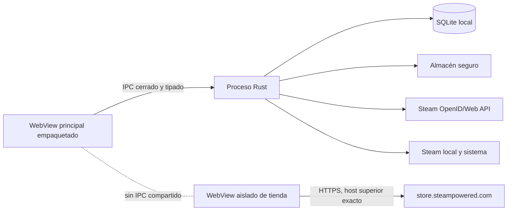

# Seguridad de Vindexa

Este documento describe las fronteras, controles y límites del código de Vindexa `0.1.0`.
No constituye una auditoría independiente ni una garantía absoluta. Para privacidad y
tratamiento de datos personales, consulta [PRIVACY.md](./PRIVACY.md).

## Índice

- [Modelo de amenazas](#modelo-de-amenazas)
- [Fronteras de confianza](#fronteras-de-confianza)
- [Credenciales y autenticación](#credenciales-y-autenticación)
- [Red y contenido remoto](#red-y-contenido-remoto)
- [Puente para agentes externos](#puente-para-agentes-externos)
- [Sistema, SQLite y copias](#sistema-sqlite-y-copias)
- [Controles de la interfaz](#controles-de-la-interfaz)
- [Dependencias, firma y actualizaciones](#dependencias-firma-y-actualizaciones)
- [Informar de una vulnerabilidad](#informar-de-una-vulnerabilidad)

## Modelo de amenazas

Vindexa protege principalmente frente a:

- contenido remoto o entradas manipuladas que intenten obtener acceso nativo;
- URLs, AppID o rutas locales proporcionados fuera de las allowlists esperadas;
- respuestas HTTP excesivas, redirecciones inesperadas o imágenes con tipo falso;
- SQL injection y restauración de bases incompatibles o sustituidas mediante enlaces;
- filtración accidental de la Steam Web API Key hacia SQLite, React, logs o backups;
- replay o falsificación del callback OpenID;
- pérdida de organización personal durante una sincronización o una restauración fallida.

Quedan fuera del modelo:

- un sistema operativo, proceso de Steam o cuenta ya comprometidos;
- malware con acceso al usuario y a sus archivos o Keychain desbloqueado;
- cifrado de notas, rutas o backups SQLite en reposo;
- disponibilidad o exactitud permanente de endpoints y datos de Steam;
- garantía de bloqueo total de publicidad o seguimiento dentro de contenido web remoto.

## Fronteras de confianza

La ventana principal ejecuta recursos empaquetados y solo puede invocar los comandos
registrados en `src-tauri/src/lib.rs`. Las operaciones de red, archivos, SQLite y sistema se
realizan en Rust. La ventana remota de tienda se crea con otra etiqueta y no recibe
capabilities ni un puente IPC de Vindexa.

## Credenciales y autenticación

### Steam OpenID

- La contraseña y Steam Guard se introducen únicamente en el navegador oficial.
- El callback usa `127.0.0.1`, puerto aleatorio, ruta exacta y estado de un solo uso.
- Rust comprueba namespace, proveedor, `return_to`, identidad, campos firmados y claimed ID.
- La afirmación se vuelve a validar con Steam mediante `check_authentication`.
- Los nonces recientes se persisten para impedir replay.
- Solo puede existir un login activo; hay límites de tiempo, callbacks y tamaño.

### Steam Web API Key

- Se acepta únicamente una cadena hexadecimal con la forma validada por el backend.
- Se guarda con `keyring` bajo el servicio `io.vindexa.desktop` y la cuenta
  `steam-web-api-key`.
- SQLite conserva solo un marcador no secreto de disponibilidad.
- `bootstrap` no consulta Keychain. Guardar, comprobar voluntariamente, sincronizar o
  eliminar son las únicas acciones que acceden al secreto.
- La clave no se devuelve al frontend, no forma parte del backup y no debe aparecer en
  diagnósticos.

## Red y contenido remoto

El backend usa destinos fijos de Steam, HTTPS, timeouts, límites de cuerpo y rechazo de
redirecciones. Las respuestas JSON deben declarar el tipo de contenido esperado. El arte se
acepta solo desde hosts Steam permitidos, con AppID coherente, tamaño máximo, MIME y firma
binaria válidos; se escribe primero en un temporal.

La actualización de metadatos usa `store.steampowered.com/api/appdetails`. Es un endpoint
oficial por dominio, pero Valve no lo documenta como contrato estable; el resultado se
cachea y cualquier ausencia se representa como **Sin datos**. Los logros usan el método
documentado `ISteamUserStats/GetPlayerAchievements` y solo se solicitan por acción expresa.

Las publicaciones de Discovery usan exclusivamente el método público documentado
`ISteamNews/GetNewsForApp/v2` en el host exacto `api.steampowered.com`, sin Web API Key.
El cliente desactiva redirecciones, limita conexión, tiempo total y cuerpo, exige JSON y
comprueba AppID y feed antes de persistir. Solo se guardan título, extracto saneado como
texto plano, fuente y fecha; ni HTML ni URLs remotas llegan a la interfaz. La caché se
refresca como máximo cada seis horas por juego, en lotes de cuatro, con backoff acotado y
solo códigos de error no sensibles persistidos.

### Navegador integrado de tiendas

La acción **Tienda integrada** abre una ventana remota por tienda, etiquetada
`vindexa-store-<tienda>`, con estas restricciones:

- navegación superior limitada a HTTPS, puerto 443, sin credenciales en la URL y con host
  verificado contra la lista cerrada de cada tienda: Steam (`store`, `checkout`, `login` y
  `help`.steampowered.com, más `steamcommunity.com`), GOG (`gog.com`, `www`, `login`,
  `auth`), Epic (`store.epicgames.com`, `www.epicgames.com`, `epicgames.com`) e itch.io
  (`itch.io` y los subdominios de creador);
- `steamdb.info` queda deliberadamente fuera: no es una tienda ni la opera Valve;
- dieciocho esquemas peligrosos rechazados en navegación superior, entre ellos `file:`,
  `javascript:`, `data:`, `blob:`, `view-source:` y `steam:` — la desinstalación tiene que
  seguir pasando por los comandos de Vindexa, nunca por una página de la tienda;
- verificación estructural del host, no por sufijo: `evilstore.steampowered.com.attacker.tld`
  e `itch.io.attacker.tld` fallan, y los homógrafos internacionalizados se comparan ya en
  punycode;
- modo privado, autofill general, extensiones y arrastre de archivos desactivados; DevTools
  solo en compilaciones de depuración;
- nuevas ventanas y descargas denegadas; un `target="_blank"` legítimo se reconduce a la
  misma ventana y vuelve a pasar por la política;
- ninguna capability Tauri: `capabilities/store-browser.json` declara una lista de permisos
  vacía para `vindexa-store-*`, y Tauri rechaza además cualquier invocación de origen remoto
  sin capability `remote` explícita;
- historial solo en memoria, borrado al cerrar la ventana. Lo único que se persiste es el
  zoom por tienda.

El bloqueador nativo compila ciento siete reglas: ochenta dominios de publicidad y rastreo
de terceros bloqueados por la URL del recurso, veintidós dominios de las tiendas y sus CDN
protegidos con `ignore-previous-rules`, y cinco reglas cosméticas. La telemetría de primera
parte de cada tienda **no** se bloquea: la regla crítica es que la tienda no se rompa.

> [!NOTE]
> Las reglas anteriores a esta revisión no bloqueaban nada. WebKit evalúa `if-domain` contra
> el documento principal, no contra la URL del recurso, así que una regla con
> `if-domain: ["*doubleclick.net"]` solo se dispara si la página **es** doubleclick.net.

En macOS y Linux, WebKit compila la lista nativa antes de navegar. Si cualquiera de las
rutas no puede instalarla, cierra la ventana y devuelve `store_protection`: falla en
cerrado, no en silencio. En Windows no hay equivalente nativo, así que hay aislamiento por
host, sin descargas, sin ventanas emergentes y sin IPC, **pero sin bloqueo de anuncios**.

La ruta Linux está implementada pero todavía no se ha validado en una sesión gráfica Bazzite
real.

> [!IMPORTANT]
> El inicio de sesión y el carrito funcionan dentro de la ventana, pero la sesión es privada
> y no sobrevive al cierre. La barra del navegador vive en el contexto del documento remoto
> y **no es una frontera de seguridad**: las fronteras son la política de navegación nativa,
> la ausencia de IPC, y el bloqueo de descargas y de ventanas emergentes.

### Reproductor de vídeo incrustado

La lista de deseados puede incrustar un vídeo. `frame-src` admite exactamente un origen,
`https://www.youtube-nocookie.com`, y **la URL la construye Rust** tras validar que el
identificador cumple el formato exacto de once caracteres; el frontend nunca la concatena.
Tauri inyecta su puente IPC solo en el marco principal, así que el iframe no lo recibe, y la
lista de control rechaza cualquier invocación de origen remoto. El bloqueador de contenido
**no** cubre ese iframe: vive en la ventana principal, no en una ventana de tienda.

### Puente para agentes externos

Un agente externo puede conducir Vindexa a través de un catálogo **cerrado y tipado** de
dieciocho intenciones. La especificación completa está en `docs/AGENT_BRIDGE.md`.

- **Autenticación por token** con hash y sal (`pbkdf2-sha256`, 120 000 iteraciones, sal única
  por cliente). El token se entrega una sola vez y solo se guarda su resumen. El secreto trae
  256 bits de entropía del generador del sistema.
- **Ámbitos por cliente**, conjunto cerrado y sin comodín, verificados **antes** de resolver
  nombres o escribir. Un ámbito desconocido deja el cliente sin ninguno.
- **Confirmación humana obligatoria** para quitar juegos de una colección y para cualquier
  acción que afecte a más de cinco juegos. La confirma la persona desde Vindexa, **sin token
  de agente**: si el agente pudiera aprobarse a sí mismo, la barrera no existiría.
- **Deshacer** con recibo que guarda el estado anterior y el aplicado. Al deshacer se
  comprueba que la base sigue siendo exactamente lo aplicado; si no, se rechaza en vez de
  pisar ediciones posteriores. Token de un solo uso.
- **Auditoría completa**: una fila por petición, con la intención, la frase original, los
  argumentos, el resultado y los juegos afectados. El cambio y su fila viajan en la misma
  transacción. El token nunca aparece en el registro.
- **Límite de frecuencia** por cliente, aplicado antes de autenticar para proteger también la
  derivación de clave.
- **Sin puerto de red.** El puente es una API de proceso: se invoca por comando Tauri. Un
  socket TCP en el bucle local sería accesible para cualquier proceso local y para cualquier
  página web capaz de pedirle; si algún día hiciera falta salir del proceso, la única forma
  compatible sería un socket de dominio Unix con permisos `0600` bajo el directorio de datos.
- **El agente crea y organiza, no destruye.** No existe intención para borrar colecciones,
  listas, juegos ni estados.

> [!IMPORTANT]
> La implementación criptográfica es propia y no ha sido auditada por terceros. Está
> verificada contra los vectores oficiales de FIPS 180-4, RFC 4231 y RFC 7914, y lo que
> domina el coste de un ataque es la entropía del secreto, no la función de derivación. Aun
> así, sustituirla por `argon2` es trabajo pendiente y está anotado como tal.

## Sistema, SQLite y copias

- Los AppID deben ser enteros positivos y las acciones Steam proceden de una allowlist.
- Las rutas de instalación se canonicalizan y deben seguir bajo una biblioteca Steam
  detectada antes de revelarse.
- La desinstalación solo solicita `steam://uninstall/<app-id>` para un juego que siga
  registrado como instalado; Steam conserva el control y la confirmación final.
- Todas las consultas usan parámetros. Los fragmentos dinámicos de filtros y ordenación
  proceden de allowlists internas.
- SQLite activa claves foráneas, WAL, `synchronous = FULL` y timeout ante bloqueos.
- Inicio y diagnóstico validan integridad, foreign keys, historial de migraciones y huella
  del esquema.
- Importación, sincronización, exportación y restauración se coordinan con locks de proceso.
- La restauración valida identidad y esquema, rechaza la base activa y enlaces equivalentes,
  crea un respaldo previo y revierte si la base resultante no supera los gates.

## Controles de la interfaz

- Las acciones destructivas usan confirmación explícita cuando la preferencia está activa.
- Los atajos se validan, no se disparan dentro de campos editables y no admiten colisiones.
- El drag and drop de biblioteca es transaccional y el recibo de deshacer se invalida si el
  estado o el orden han cambiado, evitando sobrescribir ediciones posteriores.
- Errores nativos cruzan IPC como código y mensaje acotado, sin detalles internos o secretos.

## Dependencias, firma y actualizaciones

Las versiones JavaScript y Rust se fijan en `pnpm-lock.yaml`, `Cargo.lock`, `package.json` y
`Cargo.toml`. Antes de una release ejecuta los gates de [TESTING.md](./TESTING.md), incluidos
`pnpm audit:dependencies`, que ejecuta `pnpm audit --prod` y
`cargo audit --file src-tauri/Cargo.lock`, con evaluación manual de alcance.

La auditoría local del 14 de agosto de 2026 no encontró vulnerabilidades conocidas en las
dependencias de producción JavaScript ni vulnerabilidades Rust clasificadas como fallo. Sí
registró 17 avisos permitidos en la rama Linux: bindings GTK3 y utilidades transitivas sin
mantenimiento, además de
[`RUSTSEC-2024-0429`](https://rustsec.org/advisories/RUSTSEC-2024-0429) para `glib 0.18.5`.
Ese advisory afecta a `VariantStrIter`; Vindexa no usa esa API directamente y la dependencia
entra por Tauri/WebKitGTK, pero no se ha demostrado su ausencia de alcance en Bazzite. Debe
revisarse con el árbol efectivo y el smoke Linux antes de certificar esa plataforma, y
actualizarse cuando la rama Tauri/GTK permita `glib >= 0.20` sin romper compatibilidad.

La configuración actual no incluye endpoint de releases, manifiesto firmado, clave pública
de updater, Developer ID ni notarización. **Buscar actualizaciones** es deliberadamente
informativo y nunca descarga o ejecuta binarios. No distribuyas un bundle local como si
estuviera firmado.

## Informar de una vulnerabilidad

No publiques una prueba que incluya Web API Key, SteamID64, base SQLite, backup, rutas de
usuario o capturas privadas. Entrega de forma privada:

- versión y sistema operativo;
- superficie afectada y precondiciones;
- pasos mínimos reproducibles con datos no sensibles;
- impacto observado;
- código de error visible y mitigación temporal, si existe.

Hasta que el proyecto publique un canal de seguridad verificable, no se debe inventar una
dirección de correo o URL de reporte. Conserva el informe en privado y contacta al
mantenedor por el canal autenticado desde el que recibiste el software.
