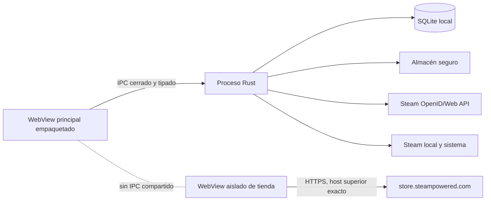

# Seguridad de Vindexa

Este documento describe las fronteras, controles y límites del código de Vindexa `0.1.0`.
No constituye una auditoría independiente ni una garantía absoluta. Para privacidad y
tratamiento de datos personales, consulta [PRIVACY.md](./PRIVACY.md).

## Índice

- [Modelo de amenazas](#modelo-de-amenazas)
- [Fronteras de confianza](#fronteras-de-confianza)
- [Credenciales y autenticación](#credenciales-y-autenticación)
- [Red y contenido remoto](#red-y-contenido-remoto)
- [Sistema, SQLite y copias](#sistema-sqlite-y-copias)
- [Controles de la interfaz](#controles-de-la-interfaz)
- [Dependencias, firma y actualizaciones](#dependencias-firma-y-actualizaciones)
- [Informar de una vulnerabilidad](#informar-de-una-vulnerabilidad)

## Modelo de amenazas

Vindexa protege principalmente frente a:

- contenido remoto o entradas manipuladas que intenten obtener acceso nativo;
- URLs, AppID o rutas locales proporcionados fuera de las allowlists esperadas;
- respuestas HTTP excesivas, redirecciones inesperadas o imágenes con tipo falso;
- SQL injection y restauración de bases incompatibles o sustituidas mediante enlaces;
- filtración accidental de la Steam Web API Key hacia SQLite, React, logs o backups;
- replay o falsificación del callback OpenID;
- pérdida de organización personal durante una sincronización o una restauración fallida.

Quedan fuera del modelo:

- un sistema operativo, proceso de Steam o cuenta ya comprometidos;
- malware con acceso al usuario y a sus archivos o Keychain desbloqueado;
- cifrado de notas, rutas o backups SQLite en reposo;
- disponibilidad o exactitud permanente de endpoints y datos de Steam;
- garantía de bloqueo total de publicidad o seguimiento dentro de contenido web remoto.

## Fronteras de confianza

La ventana principal ejecuta recursos empaquetados y solo puede invocar los comandos
registrados en `src-tauri/src/lib.rs`. Las operaciones de red, archivos, SQLite y sistema se
realizan en Rust. La ventana remota de tienda se crea con otra etiqueta y no recibe
capabilities ni un puente IPC de Vindexa.

## Credenciales y autenticación

### Steam OpenID

- La contraseña y Steam Guard se introducen únicamente en el navegador oficial.
- El callback usa `127.0.0.1`, puerto aleatorio, ruta exacta y estado de un solo uso.
- Rust comprueba namespace, proveedor, `return_to`, identidad, campos firmados y claimed ID.
- La afirmación se vuelve a validar con Steam mediante `check_authentication`.
- Los nonces recientes se persisten para impedir replay.
- Solo puede existir un login activo; hay límites de tiempo, callbacks y tamaño.

### Steam Web API Key

- Se acepta únicamente una cadena hexadecimal con la forma validada por el backend.
- Se guarda con `keyring` bajo el servicio `io.vindexa.desktop` y la cuenta
  `steam-web-api-key`.
- SQLite conserva solo un marcador no secreto de disponibilidad.
- `bootstrap` no consulta Keychain. Guardar, comprobar voluntariamente, sincronizar o
  eliminar son las únicas acciones que acceden al secreto.
- La clave no se devuelve al frontend, no forma parte del backup y no debe aparecer en
  diagnósticos.

## Red y contenido remoto

El backend usa destinos fijos de Steam, HTTPS, timeouts, límites de cuerpo y rechazo de
redirecciones. Las respuestas JSON deben declarar el tipo de contenido esperado. El arte se
acepta solo desde hosts Steam permitidos, con AppID coherente, tamaño máximo, MIME y firma
binaria válidos; se escribe primero en un temporal.

La actualización de metadatos usa `store.steampowered.com/api/appdetails`. Es un endpoint
oficial por dominio, pero Valve no lo documenta como contrato estable; el resultado se
cachea y cualquier ausencia se representa como **Sin datos**. Los logros usan el método
documentado `ISteamUserStats/GetPlayerAchievements` y solo se solicitan por acción expresa.

Las publicaciones de Discovery usan exclusivamente el método público documentado
`ISteamNews/GetNewsForApp/v2` en el host exacto `api.steampowered.com`, sin Web API Key.
El cliente desactiva redirecciones, limita conexión, tiempo total y cuerpo, exige JSON y
comprueba AppID y feed antes de persistir. Solo se guardan título, extracto saneado como
texto plano, fuente y fecha; ni HTML ni URLs remotas llegan a la interfaz. La caché se
refresca como máximo cada seis horas por juego, en lotes de cuatro, con backoff acotado y
solo códigos de error no sensibles persistidos.

### Ventana integrada de la tienda

La acción **Tienda integrada** abre una ventana remota separada con estas restricciones:

- URL inicial y navegación superior limitadas al esquema HTTPS y al host exacto
  `store.steampowered.com`;
- modo privado, autofill general y DevTools desactivados;
- nuevas ventanas y descargas denegadas;
- ninguna capability Tauri ni acceso a SQLite, Keychain o comandos de Vindexa.

En macOS y Linux, WebKit abre primero `about:blank`, compila una lista nativa con timeout,
bloquea una lista corta de hosts de analítica y oculta el popup de cookies. Solo después
navega a Steam. macOS emplea `WKContentRuleList`; Linux instala el filtro mediante la API
nativa de WebKitGTK. Si cualquiera de las rutas no puede instalar la regla, cierra la
ventana y devuelve `store_protection`.

La ruta Linux está implementada, pero todavía no se ha validado en una sesión gráfica
Bazzite real. El aislamiento por host, modo privado, ausencia de IPC, popups/descargas
denegados y autofill/DevTools desactivados sigue siendo una frontera independiente.

> [!IMPORTANT]
> Es una vista limitada de la tienda, no un navegador general ni un bloqueador publicitario
> completo. El HTML y los subrecursos siguen perteneciendo a Steam. No introduzcas
> credenciales si una navegación requiere salir del host permitido; usa el navegador
> oficial para iniciar sesión o gestionar la cuenta.

## Sistema, SQLite y copias

- Los AppID deben ser enteros positivos y las acciones Steam proceden de una allowlist.
- Las rutas de instalación se canonicalizan y deben seguir bajo una biblioteca Steam
  detectada antes de revelarse.
- La desinstalación solo solicita `steam://uninstall/<app-id>` para un juego que siga
  registrado como instalado; Steam conserva el control y la confirmación final.
- Todas las consultas usan parámetros. Los fragmentos dinámicos de filtros y ordenación
  proceden de allowlists internas.
- SQLite activa claves foráneas, WAL, `synchronous = FULL` y timeout ante bloqueos.
- Inicio y diagnóstico validan integridad, foreign keys, historial de migraciones y huella
  del esquema.
- Importación, sincronización, exportación y restauración se coordinan con locks de proceso.
- La restauración valida identidad y esquema, rechaza la base activa y enlaces equivalentes,
  crea un respaldo previo y revierte si la base resultante no supera los gates.

## Controles de la interfaz

- Las acciones destructivas usan confirmación explícita cuando la preferencia está activa.
- Los atajos se validan, no se disparan dentro de campos editables y no admiten colisiones.
- El drag and drop de biblioteca es transaccional y el recibo de deshacer se invalida si el
  estado o el orden han cambiado, evitando sobrescribir ediciones posteriores.
- Errores nativos cruzan IPC como código y mensaje acotado, sin detalles internos o secretos.

## Dependencias, firma y actualizaciones

Las versiones JavaScript y Rust se fijan en `pnpm-lock.yaml`, `Cargo.lock`, `package.json` y
`Cargo.toml`. Antes de una release ejecuta los gates de [TESTING.md](./TESTING.md), incluidos
`pnpm audit:dependencies`, que ejecuta `pnpm audit --prod` y
`cargo audit --file src-tauri/Cargo.lock`, con evaluación manual de alcance.

La auditoría local del 14 de agosto de 2026 no encontró vulnerabilidades conocidas en las
dependencias de producción JavaScript ni vulnerabilidades Rust clasificadas como fallo. Sí
registró 17 avisos permitidos en la rama Linux: bindings GTK3 y utilidades transitivas sin
mantenimiento, además de
[`RUSTSEC-2024-0429`](https://rustsec.org/advisories/RUSTSEC-2024-0429) para `glib 0.18.5`.
Ese advisory afecta a `VariantStrIter`; Vindexa no usa esa API directamente y la dependencia
entra por Tauri/WebKitGTK, pero no se ha demostrado su ausencia de alcance en Bazzite. Debe
revisarse con el árbol efectivo y el smoke Linux antes de certificar esa plataforma, y
actualizarse cuando la rama Tauri/GTK permita `glib >= 0.20` sin romper compatibilidad.

La configuración actual no incluye endpoint de releases, manifiesto firmado, clave pública
de updater, Developer ID ni notarización. **Buscar actualizaciones** es deliberadamente
informativo y nunca descarga o ejecuta binarios. No distribuyas un bundle local como si
estuviera firmado.

## Informar de una vulnerabilidad

No publiques una prueba que incluya Web API Key, SteamID64, base SQLite, backup, rutas de
usuario o capturas privadas. Entrega de forma privada:

- versión y sistema operativo;
- superficie afectada y precondiciones;
- pasos mínimos reproducibles con datos no sensibles;
- impacto observado;
- código de error visible y mitigación temporal, si existe.

Hasta que el proyecto publique un canal de seguridad verificable, no se debe inventar una
dirección de correo o URL de reporte. Conserva el informe en privado y contacta al
mantenedor por el canal autenticado desde el que recibiste el software.
